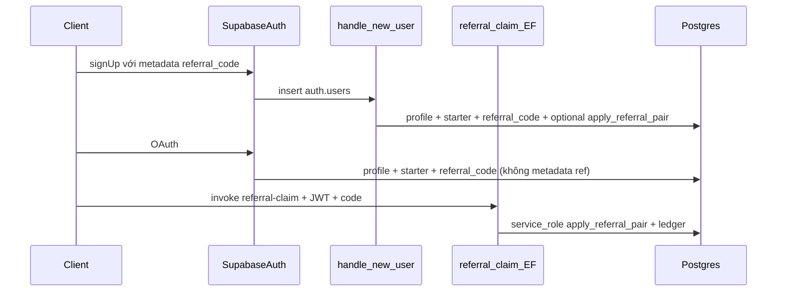

# Plan: Referral code (+ lượng cho người mời và người được mời)

## Bối cảnh codebase

- Profile + tạo user: `[handle_new_user](supabase/migrations/20260325120100_auth_create_profile.sql)` sau `INSERT auth.users`: `profiles` + `credit_ledger` `starter_grant`; starter từ `app_config.starter_credits`.
- Credits: `[profiles.credits_balance](supabase/migrations/20260325120000_initial_schema.sql)`, `[credit_ledger](supabase/migrations/20260325120000_initial_schema.sql)`.
- Đăng ký: `[app/routes/dang-ky.tsx](app/routes/dang-ky.tsx)` — `signUp({ options: { data } })` → `raw_user_meta_data` (trigger đọc `referral_code` / key thống nhất).
- OAuth: `[app/routes/dang-nhap.tsx](app/routes/dang-nhap.tsx)` `[signInWithOAuth](app/routes/dang-nhap.tsx)`; `[auth.callback.tsx](app/routes/auth.callback.tsx)` chỉ điều hướng — không metadata referral.
- Trigger bảo vệ profile: `[profiles_enforce_update_rules](supabase/migrations/20260325210000_personalization_profile_protection.sql)` — đã nhánh bypass `**service_role**` (JWT) cho toàn bộ check.

## Quy tắc nghiệp vụ (v1)

| Qui tắc                              | Cách triển khai                                                                                                                                                    |
| ------------------------------------ | ------------------------------------------------------------------------------------------------------------------------------------------------------------------ |
| Mỗi user một mã unique               | `profiles.referral_code text NOT NULL UNIQUE`, generate trong `handle_new_user` (vd. 8 ký tự, có thể loại trừ 0/O/1/I).                                            |
| Bonus cả hai phía                    | `app_config.referral_bonus_credits` (text int, default `'10'`). Cộng vào referee + referrer; 2 dòng ledger + `balance_after`.                                      |
| Một lần / referee                    | `profiles.referred_by uuid` nullable; chỉ set khi thành công; từ chối nếu đã có.                                                                                   |
| Không tự giới thiệu                  | Referrer id khác referee id; không khớp `referral_code` của chính referee.                                                                                         |
| Idempotency                          | `idempotency_key` unique: `referral_referee:{referee_uuid}`, `referral_referrer:{referrer_uuid}:{referee_uuid}`.                                                   |
| Chuẩn hóa mã                         | Lưu UPPER; so khớp `upper(trim(input))`.                                                                                                                           |
| Bonus khi nào (v1 — ghi rõ sản phẩm) | **Áp bonus ngay khi insert user** (trigger / Edge), **không** chờ xác nhận email. Nếu sau này đổi policy “chỉ sau confirm”, cần migration + job bù — không làm v1. |

## Chính sách bảo mật (bổ sung audit)

### 1. Chặn client sửa cột nhạy cảm

RLS hiện cho phép user **UPDATE** cả dòng `profiles`. **Mở rộng** `profiles_enforce_update_rules`:

- Sau nhánh bypass `service_role` (giữ nguyên).
- Với `**TG_OP = 'UPDATE'`** và **user đang sửa chính row**: `auth.uid() = NEW.id` (hoặc tương đương an toàn trong Supabase), nếu `credits_balance`, `referred_by`, hoặc `referral_code` **khác** `OLD` → `RAISE EXCEPTION` (chỉ server/trigger/Edge service_role được đổi các cột này).

`handle_new_user` chạy trong ngữ cảnh auth internal: thường **không** có `auth.uid() = NEW.id` cho session của end-user khi trigger DB chạy INSERT rồi UPDATE — verify sau migration trên staging; nếu `auth.uid()` trùng edge case, dùng `pg_trigger_depth()` / cờ transaction chỉ khi bắt buộc.

### 2. Không dùng RPC `claim_referral` chỉ SECURITY DEFINER + UPDATE (nếu đã chặn cột theo kiểu trên)

Gọi RPC từ browser có JWT `authenticated`: PostgREST thực thi UPDATE với role đó → trigger **chặn** thay đổi `credits_balance`. **Cách đã chốt trong plan (post-audit):**

- **Edge Function `referral-claim`**: client `invoke('referral-claim', { code })` kèm Bearer user JWT; handler verify session, đọc `referral_bonus_credits`, dùng **Supabase admin (service_role)** cập nhật `profiles` + `credit_ledger` (atomic, idempotent). Cùng quy tắc nghiệp vụ như nhánh referral trong `handle_new_user` (có thể tách hàm SQL `INTERNAL` chỉ gọi từ trigger/Edge bằng `service_role` hoặc duplicate có kiểm thử — ưu tiên **một hàm SQL** `apply_referral_pair(referee_id, referrer_id, bonus)` SECURITY DEFINER gọi bởi trigger + Edge để tránh lệch logic).

### 3. Foreign key `referred_by`

`referred_by uuid REFERENCES profiles(id) **ON DELETE SET NULL`** — tránh chặn xóa user referrer (nếu sau này admin xóa tài khoản); ledger vẫn là nguồn sự thật lịch sử.

### 4. Atomic + race

Toàn bộ bonus trong **một transaction** (trigger block hoặc hàm SQL). Hai referee song song không làm referrer âm (chỉ cộng). Idempotency keys xử lý gọi trùng `referral-claim`.

### 5. SessionStorage (OAuth)

- Một key cố định, vd. `ngaytot_pending_referral`.
- **Xóa** khi `signOut` và sau `invoke` thành công hoặc sau khi xử lý xong (kể cả mã sai — tránh lặp vô hạn; throttling phía server tùy chọn v1).

## Kiến trúc xử lý (cập nhật)

## Backend / DB — checklist

1. **Migration**
  - `referral_code`, `referred_by` (FK `ON DELETE SET NULL`), unique + index nếu cần báo cáo.
  - Backfill `referral_code` cho user cũ.
  - `app_config.referral_bonus_credits` = `'10'`.
2. **Hàm nội bộ** (khuyến nghị): `apply_referral_pair(referee_user_id uuid, referrer_user_id uuid)` hoặc tên tương đương — chỉ gọi từ `handle_new_user` (sau khi có referee profile id) và từ Edge (service_role). Kiểm tra: không self, bonus > 0, referrer tồn tại, referee `referred_by` null, idempotency insert ledger.
3. `**handle_new_user`**: generate `referral_code`; đọc `NEW.raw_user_meta_data->>'referral_code'` (một key duy nhất, document trong code); nếu hợp lệ → gọi hàm apply trong cùng transaction.
4. `**profiles_enforce_update_rules`**: như mục bảo mật (1).
5. **Edge `referral-claim`**: verify JWT user; parse code; lookup referrer; gọi cùng hàm apply; trả **JSON** `{ ok, error_code }` (vd. `invalid_code`, `already_redeemed`, `self`, `success`) — tránh chỉ `boolean` cho UX/toast.
6. `**supabase/config.toml`**: `[functions.referral-claim] verify_jwt = false` + verify JWT trong handler (pattern giống `payos-create-checkout`).

## Frontend — checklist

1. **dang-ky**: `?ref=` / `?referral=` + field; `signUp.data.referral_code` khớp trigger.
2. **dang-nhap**: trước OAuth, lưu ref vào `sessionStorage` (`ngaytot_pending_referral`).
3. **auth.callback hoặc app.tsx**: sau session, đọc storage → `invoke('referral-claim')` một lần → clear storage; map `error_code` → toast tối thiểu.
4. **signOut**: clear `ngaytot_pending_referral`.
5. **Cài đặt**: hiển thị mã + copy; link `VITE_APP_URL/dang-ky?ref=...`.
6. **Types**: `supabase gen types`; cấu hình body Edge trong client types nếu cần.

## Kiểm thử tay (mở rộng audit)

- Email + mã hợp lệ → hai balance + 2 ledger + `referred_by`.
- Mã sai / rỗng → chỉ starter.
- **Không** PATCH trực tiếp `credits_balance` / `referred_by` / `referral_code` qua PostgREST với user JWT (expect lỗi).
- `referral-claim` hai lần → idempotent / không double bonus.
- OAuth + sessionStorage → bonus sau invoke.
- Đổi `referral_bonus_credits` → **chỉ user sự kiện sau thay đổi** nhận số mới (không retroactive — ghi trong docs).

## Phạm vi không làm (v1)

- Giới hạn referral/ngày; chống abuse nâng cao.
- Bonus chỉ sau xác nhận email (đã chọn: bonus ngay insert).
- Retroactive khi admin đổi bonus.

