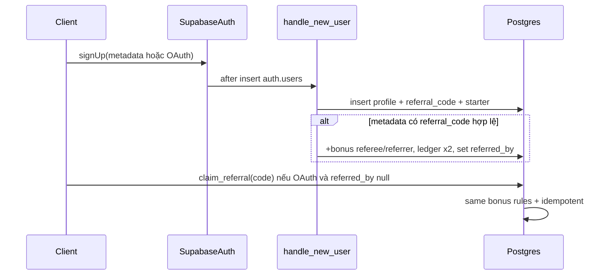

# Plan: Referral code (+ lượng cho người mời và người được mời)

## Bối cảnh codebase

- Profile + tạo user: trigger [`supabase/migrations/20260325120100_auth_create_profile.sql`](supabase/migrations/20260325120100_auth_create_profile.sql) — `handle_new_user()` chạy **sau insert** `auth.users`, tạo `profiles` + dòng `credit_ledger` `starter_grant`. Starter lấy từ [`app_config.starter_credits`](supabase/migrations/20260327120000_seed_feature_costs_and_app_config.sql).
- Credits / ledger: [`profiles.credits_balance`](supabase/migrations/20260325120000_initial_schema.sql) + [`credit_ledger`](supabase/migrations/20260325120000_initial_schema.sql) (ghi chủ yếu qua service_role / SECURITY DEFINER).
- Đăng ký email: [`app/routes/dang-ky.tsx`](app/routes/dang-ky.tsx) — `supabase.auth.signUp({ options: { data: { ... } } })` → metadata vào `raw_user_meta_data` (đủ để trigger đọc mã giới thiệu nếu truyền vào `data`).
- OAuth: [`app/routes/auth.callback.tsx`](app/routes/auth.callback.tsx) chỉ điều hướng sau session — **không** truyền `referral` vào metadata mặc định; cần đường bù sau khi có session (sessionStorage + RPC/EF hoặc `updateUser` không đủ để chạy lại trigger). **Khuyến nghị:** hàm SQL `SECURITY DEFINER` `claim_referral(p_code text)` gọi một lần từ client khi `referred_by is null`.

## Quy tắc nghiệp vụ (v1)

| Qui tắc | Cách triển khai gợi ý |
|--------|------------------------|
| Mỗi user một mã unique | Cột `profiles.referral_code` **NOT NULL UNIQUE**, generate trong `handle_new_user` (vd. 8 ký tự chữ+ số, loại trừ ký tự gây nhầm 0/O/1/I nếu muốn). |
| Bonus cho cả hai | Đọc `app_config.referral_bonus_credits` (integer, default 10 trong migration seed). Cộng `bonus` vào **referee** và **referrer**; 2 dòng ledger + cập nhật `balance_after`. |
| Một lần / người được mời | Cột `profiles.referred_by uuid` nullable, FK → `profiles(id)`; chỉ set khi apply thành công; RPC/tigger từ chối nếu đã có `referred_by`. |
| Không tự giới thiệu chính mình | So sánh `referrer.id <> new.id`. |
| Idempotency | Khóa `idempotency_key` unique: vd. `referral_referee:{referee_user_id}`, `referral_referrer:{referrer_id}:{referee_user_id}`. |
| Chuẩn hóa mã | Lưu `referral_code` dạng canonical (vd. UPPER); so khớp case-insensitive qua `upper(trim(input))`. |

## Kiến trúc xử lý (mermaid)

## Việc cần làm — Backend / DB

1. **Migration mới** (một file SQL, đặt tên theo chuỗi hiện có):
   - `ALTER TABLE profiles` thêm:
     - `referral_code text NOT NULL UNIQUE` — với user cũ: backfill bằng batch generate (loop PL/pgSQL hoặc nhiều `UPDATE ... FROM generate_series` + kiểm tra unique).
     - `referred_by uuid REFERENCES profiles(id)` nullable; index `(referred_by)` tùy báo cáo.
   - `INSERT INTO app_config` `referral_bonus_credits` = `'10'` (string như `starter_credits`).
   - **Sửa `handle_new_user`:** sau khi insert profile và ledger starter:
     - Generate + `UPDATE profiles SET referral_code = ...` (hoặc insert đủ cột nếu đổi thành insert một bước).
     - Đọc mã từ `NEW.raw_user_meta_data->>'referral_code'` (và/hoặc key chuẩn một tên duy nhất ví dụ `ref`).
     - Nếu mã khớp referrer và rules OK: cộng bonus (transaction hoặc block `EXCEPTION` an toàn), insert `credit_ledger` với `reason` ví dụ `referral_bonus_referee` / `referral_bonus_referrer`, metadata JSON (`referrer_id`, `referee_id`, `code`).
   - **Hàm `public.claim_referral(p_code text)`** `SECURITY DEFINER`, `SET search_path = public`, kiểm tra `auth.uid()` = referee, `referred_by IS NULL`, referrer tồn tại, không self, cùng logic cộng lượng + ledger + set `referred_by`. Trả `boolean` hoặc enum kết quả cho UI.
2. **RLS:** không mở update `credits_balance` / `referred_by` cho user thường; mọi thay đổi qua trigger + `claim_referral` definer.
3. **Admin config:** `referral_bonus_credits` giống các key `app_config` khác — dashboard admin (hoặc SQL) cập nhật; document trong [`artifacts/docs/admin-dashboard-context.md`](artifacts/docs/admin-dashboard-context.md).

## Việc cần làm — Frontend

1. **[`app/routes/dang-ky.tsx`](app/routes/dang-ky.tsx):**
   - Đọc `?ref=` hoặc `?referral=` từ URL (đồng bộ với landing share link).
   - Ô nhập tùy chọn “Mã giới thiệu” + đồng bộ với query param.
   - Truyền vào `signUp`: `options.data.referral_code` (hoặc key thống nhất với trigger).
2. **OAuth / Google:** Trên [`app/routes/dang-nhap.tsx`](app/routes/dang-nhap.tsx) (và flow có `signInWithOAuth`): trước redirect, lưu mã từ `?ref=` vào `sessionStorage`. Sau khi [`auth.callback`](app/routes/auth.callback.tsx) có session (hoặc ngay [`app/routes/app.tsx`](app/routes/app.tsx) lần đầu vào app): nếu đã đăng nhập, gọi `supabase.rpc('claim_referral', { p_code })` một lần, xóa storage; bỏ qua lỗi business (đã dùng mã / mã sai).
3. **Cài đặt / chia sẻ:** Hiển thị “Mã giới thiệu của bạn” (đọc `profile.referral_code`), nút copy + gợi ý link `https://…/dang-ky?ref=CODE`. Cập nhật copy sản phẩm (starter + giới thiệu).
4. **Types:** Chạy `supabase gen types` sau migration; cập nhật [`app/lib/database.types.ts`](app/lib/database.types.ts) hoặc generate.

## Kiểm thử tay

- Đăng ký email với mã hợp lệ → cả hai balance + 2 ledger.
- Đăng ký mã sai / không có referrer → chỉ starter.
- Không cho `claim_referral` hai lần.
- OAuth + sessionStorage ref → bonus sau `claim_referral`.
- Đổi `referral_bonus_credits` trong `app_config` → user mới nhận đúng số mới.

## Phạm vi không làm (v1)

- Giới hạn số người giới thiệu / ngày; phát hiện gian lận nâng cao.
- Tự động invalidate khi admin đổi bonus (chỉ áp user sau thay đổi).
