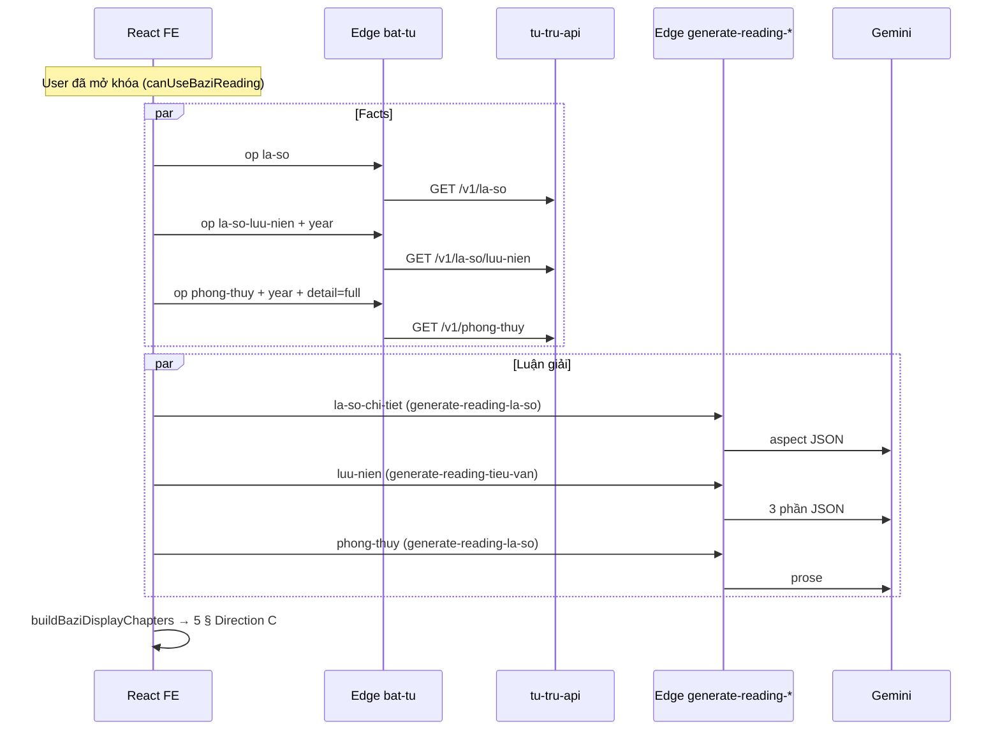

# Luận giải Bát tự năm (màn 18) — Kiểm tra wire API/BE & yêu cầu còn thiếu

**Route:** `/toi/luan-bat-tu`  
**Design (Direction C):** màn **18** · Luận giải Bát tự năm — spec `artifacts/design/ngaylanhthangtot-vn/FE-HANDOFF.md` §1 (artboard 18), prototype `c-screens-g.jsx` (`CBaziReadingFull`)  
**FE:** `CBaziReadingScreen`, `CBaziReadingPaywallView`, `CBaziReadingChapter`, `CBaziMenhTongQuanBlock`, `CBaziTinhCachSection`, `CBaziVanNamSection`, `CBaziPhongThuySection`, `CBaziQuyNhanSection`, `bazi-reading-load.ts`, `bazi-reading-outline.ts`, `bazi-reading-session.ts`, `personality-traits-ui.ts`, `luu-nien-facts-ui.ts`  
**Tham chiếu tổng:** `artifacts/integrations/tu-tru-api-direction-c-requirements.md` (REQ-P2-01 … P2-05)  
**OpenAPI upstream:** [tu-tru-api Swagger](https://tu-tru-api.fly.dev/docs#/) · **`0.1.3`** (`openapi.json`)

> **Thuật ngữ:** **Direction C** là design system / spec sản phẩm. File `c-screens-g.jsx` chỉ là **prototype JSX trong repo** để port — không phải một “design Make” riêng. Khi doc nói “khớp spec” = khớp **Direction C màn 18**, không phải công cụ Figma Make.

### OpenAPI 0.1.3 — đã khóa cho màn 18

| Schema | Field chính (Direction C) | FE parser / UI |
|--------|---------------------------|----------------|
| `LuuNienResponse` | `year_can_chi`, `year_rating`, `life_areas[]`, `warnings[]`, `month_scores` / `month_score_values`, `quy_nhan`, `dai_van_next`, `teaser` | `parseLuuNienFactsView` → §03/§05 · ✅ `dai_van_next` trong `CBaziQuyNhanSection` |
| `PhongThuyResponse` | `huong_tot_nam_nay`, `huong_xau_nam_nay`, `mau_may_man`, `phi_tinh[]` (`PhiTinhDirection`), `phi_tinh_note_vi` | `parsePhongThuyFactsView` → §04 |
| `LaSoResponse` | `personality_traits[]` (`id`, `title`, `text`) | ✅ `parsePersonalityTraitsFromLaSo` → `CBaziTinhCachSection` (+ Gemini intro khi có traits) |

Runtime vẫn cần staging trả đủ field; contract OpenAPI đã sẵn để rich UI hiện khi có data.

---

## 1. Luồng tổng quát (đã wire)

**Paywall (chưa mở khóa):**

| Bước | Wire | Ghi chú |
|------|------|---------|
| `bat-tu` → `la-so` + merge enrichment | ✅ | §01 `loadBaziPaywallLaSoDisplay` |
| `profiles.la_so` | ✅ | Fallback nếu `la-so` lỗi |
| `generate-reading` `la-so-chi-tiet` + `preview: true` | ✅ | §02 Tính cách (1 section) |
| `bat-tu` → `la-so-luu-nien` | 🟡 | Chỉ khi đã entitlement — paywall thường 403; tiêu đề fallback “Vận năm” |
| §01 paywall | ✅ Gemini preview | `loadBaziPaywallBundle` (1× `la-so` + prompt preview chỉ `menh_tong_quan`) |
| §02–§05 paywall | ✅ Mock FE | `bazi-paywall-mock.ts` — rich UI blur (Tính cách → Quý nhân) |

**Session cache (đã mở khóa):** `sessionStorage` v2 (`w11` revision) lưu `sections`, `yearCanChi`, `laSoDisplay`, `luuNienFactsRaw`, `phongThuyFactsRaw`. Cache hit → **không** gọi lại 3× Gemini cho đến khi user bấm **Tải lại** hoặc revision đổi.

---

## 2. Bảng đối chiếu 5 § (Direction C màn 18)

| § | Tiêu đề (Direction C) | Nguồn thiết kế | tu-tru-api (facts) | Edge `bat-tu` op | Edge Gemini | FE hiện tại | Khớp spec UI |
|---|------------------------|----------------|--------------------|------------------|-------------|-------------|--------------|
| **01** | Mệnh tổng quan | `GET /v1/la-so` | REQ-P2-01 | `la-so` | ❌ không LLM | `CBaziMenhTongQuanBlock` — tứ trụ, ngũ hành %, đại vận, dụng/kỵ | 🟡 §02 sub-block tính cách vẫn thiếu |
| **02** | Tính cách · cá tính | `la-so-chi-tiet` | REQ-P2-01b | `la-so` | `tinh_cach` | Prose | 🟡 Thiếu 4 sub-mục structured |
| **03** | Vận năm {Can Chi} | `la-so/luu-nien` | REQ-P2-02 | `la-so-luu-nien` *(gate)* | `luu-nien` → `nhin_chung`, `thuc_tien` *(không gồm `ung_xu`)* | `CBaziVanNamSection` facts + prose | 🟡 Rich UI khi API có `life_areas`, `month_scores` |
| **04** | Phong thủy {Can Chi} | `phong-thuy` | REQ-P2-05 | `phong-thuy` full *(gate)* | `phong-thuy` | `CBaziPhongThuySection` | 🟡 Rich UI khi API có hướng/màu/phi_tinh |
| **05** | Quý nhân · lưu ý | lưu niên facts | REQ-P2-02 `quy_nhan` | *(facts)* | `luu_nien_ung_xu` only | `CBaziQuyNhanSection` | 🟡 Cards tuổi hợp/xung khi API có field |

**Chú thích:** ✅ wire đúng · 🟡 prose/facts tối thiểu · 🔴 cần API field mới

---

## 3. Chi tiết BE (Supabase Edge)

### 3.1 `bat-tu` → tu-tru-api

| Op FE | Path upstream | Gate Bát tự | Dùng ở màn 18 |
|-------|---------------|-------------|----------------|
| `la-so` | `GET /v1/la-so` | Không | Facts §01 + input Gemini |
| `la-so-luu-nien` | `GET /v1/la-so/luu-nien?year=` | **403 `BAZI_READING_LOCKED`** | Facts §03/§05 + input `luu-nien` |
| `phong-thuy` | `GET /v1/phong-thuy?year=&detail=full` | **403** khi `detail=full` | Facts §04 + input `phong-thuy` |

File: `supabase/functions/bat-tu/index.ts`.

### 3.2 `bazi_reading_deliveries` (purchased full — durable)

| | |
|--|--|
| Table | `bazi_reading_deliveries` — `UNIQUE (user_id, flow_year)` |
| RLS | `SELECT` own row when `bazi_reading_unlocked_at` or active yearly sub |
| Write | Edge `bazi-reading-delivery` (service_role upsert) after full generate |
| Read | FE `fetchBaziReadingDelivery` before LLM; invalidates on `birth_revision` / `content_version` mismatch |

### 3.3 `generate-reading-*` (DeepSeek + `reading_cache` TTL)

| Endpoint | Edge function | Entitlement | Ghi chú |
|----------|---------------|-------------|---------|
| `la-so-chi-tiet` | `generate-reading-la-so` | JWT + `canUseBaziReading` | `preview: true` → không cần entitlement; 1 section |
| `luu-nien` | `generate-reading-tieu-van` | JWT + `canUseBaziReading` | REQ-BE-01 ✅ (`bazi-reading-gate.ts`) |
| `phong-thuy` | `generate-reading-la-so` | JWT + `canUseBaziReading` | REQ-BE-01 ✅ |

Shared gate: `supabase/functions/_shared/bazi-reading-gate.ts` · `requireBaziReadingAuth()`.

**Deploy:** `bat-tu`, `generate-reading-la-so`, `generate-reading-tieu-van`.

### 3.3 Mapping Gemini / facts → chương FE

`buildBaziDisplayChapters()` (`app/lib/bazi-reading-outline.ts`):

| Nguồn | § Direction C |
|-------|----------------|
| `laSo` (merge live + profile) | §01 |
| `tinh_cach` | §02 |
| `luu_nien_*` **trừ** `luu_nien_ung_xu` | §03 prose |
| `phong_thuy_*` | §04 prose |
| `luu_nien_ung_xu` only | §05 prose |
| `parseLuuNienFactsView` | §03 rich + `quyNhan` §05 |
| `parsePhongThuyFactsView` | §04 rich |

Luôn render **5 heading**; `emptyReason` khi thiếu data (REQ-FE-01 ✅).

---

## 4. Yêu cầu API / BE / FE (phần chưa đủ data)

### REQ-BR-01 · §01 — Ngũ hành % + timeline đại vận

**Trạng thái:** ✅ Đã có trên `CBaziMenhTongQuanBlock` khi `laSo` merge từ `loadBaziReadingFull` / paywall live `la-so`.

---

### REQ-BR-02 · §01 — Live `GET /v1/la-so`

**Trạng thái:** ✅ `loadBaziReadingFull` + `loadBaziPaywallLaSoDisplay` gọi `mergeLaSoJsonForChiTietDisplay`.

---

### REQ-BR-03 · §02 — Structured “Tính cách” (optional)

**OpenAPI 0.1.3:** `LaSoResponse.personality_traits[]` (`PersonalityTrait`: `id`, `title`, `text`) — đủ cho 4 sub-block Direction C.

**FE:** ✅ `CBaziTinhCachSection` — traits từ `la-so`; Gemini `tinh_cach` làm đoạn mở khi có traits, hoặc prose đầy đủ khi API chưa trả traits.

---

### REQ-BR-04 · §03 — Facts lưu niên rich

**OpenAPI 0.1.3:** ✅ `LuuNienResponse` — `life_areas`, `warnings`, `month_scores` / `month_score_values`, `year_rating`, `year_theme_vi`.

**FE:** ✅ `CBaziVanNamSection` + `parseLuuNienFactsView` — rich UI khi response runtime có field.

---

### REQ-BR-05 · §04 — Facts phong thủy rich

**OpenAPI 0.1.3:** ✅ `PhongThuyResponse` — `huong_tot` / `huong_tot_nam_nay`, `mau_may_man`, `phi_tinh[]`, `phi_tinh_note_vi`.

**FE:** ✅ `CBaziPhongThuySection` + `parsePhongThuyFactsView`.

---

### REQ-BR-06 · §05 — Quý nhân

**Trạng thái mapping:** ✅ Prose = `luu_nien_ung_xu`; cards = `quy_nhan` (`QuyNhanBlock`).

**OpenAPI 0.1.3:** ✅ `quy_nhan` trên `LuuNienResponse`; ✅ `dai_van_next` (`DaiVanNextBrief`: `display`, `theme_vi`, …).

**FE:** ✅ Block **Đại vận năm tới** từ `dai_van_next` trong `CBaziQuyNhanSection` (cùng cards tuổi hợp/xung + `luu_nien_ung_xu`).

---

### REQ-BR-07 · Paywall §02–05 — Structured mock

**FE:** ✅ `baziPaywallLockedChapters` — §02 Tính cách (4 traits mock) + §03–05 facts giả — render section components thật + blur; `yearCanChi` từ `la-so-luu-nien` khi có.

---

### REQ-BE-01 · Gate `luu-nien` + `phong-thuy`

**Trạng thái:** ✅ Đã triển khai (2026-05-29).

---

### REQ-FE-01 · Luôn 5 chương

**Trạng thái:** ✅ `buildBaziDisplayChapters`.

---

### REQ-FE-02 · Tiêu đề năm không hardcode

**Trạng thái:** ✅ `fallbackFlowYearCanChiLabel` → `""`; tiêu đề “Vận năm” / “Phong thủy năm” khi chưa có `year_can_chi`.

---

## 5. Checklist QA wire (staging)

| # | Test | Kỳ vọng |
|---|------|---------|
| 1 | User có entitlement | 5 §; §02–05 có prose hoặc facts |
| 2 | `la-so-luu-nien` 200 | §03 prose/facts; tiêu đề “Vận năm {Can Chi}” |
| 3 | `phong-thuy` full 200 | §04 |
| 4 | Thiếu `luu-nien` | §03 empty state (heading vẫn có) |
| 5 | Paywall | §01 lá số + Gemini `menh_tong_quan`; §02–05 structured mock blur |
| 6 | `preview: true` | 1 section; không full aspect |
| 7 | Vào lại màn trong cùng session | Cache v2 — không gọi lại Gemini |
| 8 | Bấm **Tải lại** | Full load + cập nhật cache |
| 9 | §03 vs §05 | Không trùng đoạn văn `luu_nien_*` |

---

## 6. Tóm tắt cho PM

| Câu hỏi | Trả lời |
|---------|---------|
| Đã gọi đúng API chưa? | **Có** — facts qua `bat-tu`; Gemini qua 2 Edge functions; gate entitlement đồng bộ. |
| Đã khớp Direction C màn 18 chưa? | **Một phần** — 5 § + block §01/§03–05; rich cards phụ thuộc API team. |
| Blocker chính? | Xác nhận **staging** trả đủ `personality_traits` + `dai_van_next` (OpenAPI 0.1.3); rich UI chỉ hiện khi runtime có data. |
| Paywall? | §01 thật (facts + Gemini tổng quan); §02–05 mock blur. |

---

*Cập nhật: 2026-05-29 — OpenAPI [0.1.3](https://tu-tru-api.fly.dev/docs#/); thuật ngữ Direction C; audit FE (prose §03/§05, cache v2, REQ-BE-01).*
