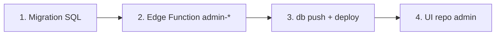

# Supabase — repo app (`Ngay-lanh-thang-tot`)

Hướng dẫn triển khai **schema, migration và Edge Functions admin** cho project dùng chung với **admin.ngaylanhthangtot.vn**.

| Repo | Vai trò |
|------|---------|
| **Ngay-lanh-thang-tot** (repo này) | `supabase/migrations/`, RPC/RLS, hầu hết `admin-*` Edge Functions |
| **admin-ngaylanhthangtot** | UI admin + deploy `admin-dashboard-stats`, `admin-users`, `admin-config`, `admin-user-actions` |

Project prod: `hptovpbiwvtngorhdhhm`

---

## 1. Chuẩn bị (một lần / máy mới)

```bash
cd Ngay-lanh-thang-tot
npm install   # nếu chưa

npx supabase login
npx supabase link --project-ref hptovpbiwvtngorhdhhm
```

Secrets trên Supabase Dashboard → Edge Functions (hoặc CLI):

```bash
npx supabase secrets set ADMIN_EMAILS="you@corp.com,other@corp.com"
npx supabase secrets set ALLOWED_ORIGIN="https://ngaylanhthangtot.vn,https://admin.ngaylanhthangtot.vn"
```

`ALLOWED_ORIGIN` phải có **cả** domain app user và admin (CORS).

---

## 2. Quy trình thêm tính năng admin (backend)

Mỗi tính năng admin mới trên UI thường cần **1–3 bước** ở repo app:



### Bước 1 — Migration (nếu cần DB mới)

**Luôn** tạo file trong `supabase/migrations/` (không tạo migration ở repo admin).

**Đặt tên:** `YYYYMMDDHHMMSS_mô_tả_ngắn.sql`  
Timestamp phải **lớn hơn** migration mới nhất trên remote (xem `npx supabase migration list --linked`).

**Ví dụ đã có:**

| Migration | Mục đích |
|-----------|----------|
| `20260531220000_admin_dashboard_stats_rpc.sql` | RPC aggregate dashboard |
| `20260531230000_admin_day_luan_ask_counts.sql` | RPC đếm hỏi AI luận ngày |
| `20260531150000_checkout_discounts.sql` | Bảng `discount_coupons` |
| `20260605120000_profile_engagement_click_counts.sql` | Cột engagement lifetime trên `profiles` + RPC `increment_profile_engagement` |

**RPC chỉ cho admin** — mẫu bắt buộc:

```sql
create or replace function public.admin_example_snapshot(...)
returns jsonb
language sql
security definer
set search_path = public
as $$ ... $$;

revoke all on function public.admin_example_snapshot(...) from public;
revoke all on function public.admin_example_snapshot(...) from anon;
revoke all on function public.admin_example_snapshot(...) from authenticated;
grant execute on function public.admin_example_snapshot(...) to service_role;
```

Không grant cho `authenticated` — admin gọi qua Edge với **service_role**.

**Bảng mới cho CS:** bật RLS; user JWT không được ghi nếu chỉ admin quản lý (pattern `discount_coupons`).

### Bước 2 — Edge Function `admin-*`

Thư mục: `supabase/functions/admin-<tên>/index.ts`

**Dùng shared auth** (đừng copy JWT verify):

```ts
import { adminJson, requireAdmin } from "../_shared/admin-auth.ts";

Deno.serve(async (req) => {
  const auth = await requireAdmin(req);
  if (auth instanceof Response) return auth;
  const { admin, cors } = auth;
  // admin = Supabase client service_role
});
```

**CORS:** `corsHeadersForRequest(req)` từ `_shared/cors.ts`.

**Gọi RPC / query:** chỉ qua `admin` (service_role), không expose service key ra client.

Đăng ký function trong `supabase/config.toml`:

```toml
[functions.admin-ten-moi]
verify_jwt = false
```

(`verify_jwt = false` vì JWT được verify thủ công trong `requireAdmin` + check `ADMIN_EMAILS`.)

**Functions admin deploy từ repo này:**

- `admin-site-banner`
- `admin-user-entitlements`
- `admin-orders`
- `admin-referrals`
- `admin-coupons`

**Deploy từ repo admin** (`admin-ngaylanhthangtot`) — không deploy từ repo app (tránh ghi đè):

- `admin-dashboard-stats` (canonical; có cache 60s in-memory)
- `admin-users`
- `admin-config`
- `admin-user-actions`

Bản sao `supabase/functions/admin-dashboard-stats/` trong repo app **deprecated** — xem `README.md` trong thư mục đó.

### Bước 3 — Apply DB + deploy

```bash
# Kiểm tra migration chưa apply
npx supabase migration list --linked

# Apply lên remote (prod/staging đã link)
npx supabase db push --linked

# Deploy function vừa sửa / thêm (admin EF từ repo app — KHÔNG gồm admin-dashboard-stats)
npx supabase functions deploy \
  admin-site-banner \
  admin-user-entitlements \
  admin-orders \
  admin-referrals \
  admin-coupons \
  --project-ref hptovpbiwvtngorhdhhm

# Edge có user engagement tracking (deploy sau khi merge migration)
npx supabase functions deploy \
  day-luan-chat \
  generate-reading-la-so \
  generate-reading-tieu-van \
  generate-reading-luu-nien \
  --project-ref hptovpbiwvtngorhdhhm \
  --no-verify-jwt
```

**Thứ tự an toàn:** `db push` trước (RPC/bảng), rồi `functions deploy` (code gọi RPC).

**Sau migration ảnh hưởng schema app:**

```bash
npx supabase gen types typescript --linked > app/lib/database.types.ts
```

### Bước 4 — Handoff sang repo admin (UI)

Trong repo **admin-ngaylanhthangtot**:

1. `app/lib/admin-<tên>.ts` — `adminFunctionGet` / `adminFunctionPost` tới `functions/v1/admin-<tên>`
2. Route + sidebar
3. **Không** migration, **không** service_role trên client

Contract JSON nên ghi trong comment đầu file Edge Function hoặc PR description.

---

## 3. Tính năng chỉ cần Edge (không migration)

Ví dụ: mở rộng admin user search SELECT thêm cột có sẵn trên `profiles`.

1. Sửa `admin-users` trên repo **admin-ngaylanhthangtot**
2. `npx supabase functions deploy admin-users --project-ref hptovpbiwvtngorhdhhm` (từ admin repo)
3. Cập nhật type + UI admin

Nếu aggregate nặng (tránh paginate cả bảng), thêm RPC ở bước 1.

---

## 4. Tính năng app user (coupon, checkout, luận ngày)

Logic nghiệp vụ **không** nằm admin repo:

| Luồng | Edge / RPC | Admin |
|-------|------------|-------|
| Coupon checkout | `payos-create-checkout` + `discount_coupons` | `admin-coupons` CRUD |
| Giảm giá khi trả tiền | `create_checkout_payment_order` | — |
| Hỏi AI luận ngày | `day-luan-chat` (+ `increment_profile_engagement` server-side) | Admin `/users` (repo admin) |

App user chỉ gửi `coupon_code`; validate 100% server.

---

## 5. Test nhanh

```bash
# Lấy JWT: đăng nhập admin trên UI hoặc Supabase Auth
export ACCESS_TOKEN="eyJ..."

curl -s -H "Authorization: Bearer $ACCESS_TOKEN" \
  -H "apikey: $SUPABASE_ANON_KEY" \
  "https://hptovpbiwvtngorhdhhm.supabase.co/functions/v1/admin-dashboard-stats"
```

Lỗi thường gặp:

| HTTP | Nguyên nhân |
|------|-------------|
| 401 | JWT hết hạn |
| 403 | Email không trong `ADMIN_EMAILS` |
| 500 + message RPC missing | Chưa `db push` migration |
| CORS | Thiếu origin admin trong `ALLOWED_ORIGIN` |

---

## 6. Checklist PR (repo app)

- [ ] File migration mới (nếu có) + timestamp đúng thứ tự
- [ ] RPC `security definer` + chỉ `service_role`
- [ ] Edge Function dùng `requireAdmin`
- [ ] Entry `[functions.admin-…]` trong `config.toml`
- [ ] `db push --linked` trên staging/prod
- [ ] `functions deploy …` đủ function đổi
- [ ] `database.types.ts` regen nếu đổi schema app
- [ ] Ghi contract API cho PR admin UI
- [ ] Không commit secret / `.env`

---

## 7. Tài liệu liên quan

- Handoff admin tổng quan: `artifacts/docs/admin-dashboard-context.md`
- Repo admin deploy EF + UI: `../admin-ngaylanhthangtot/supabase/functions/README.md` (`admin-dashboard-stats`, `admin-users`, …)

**Nguyên tắc:** một database, **một thư mục migration** — luôn là repo app này.
